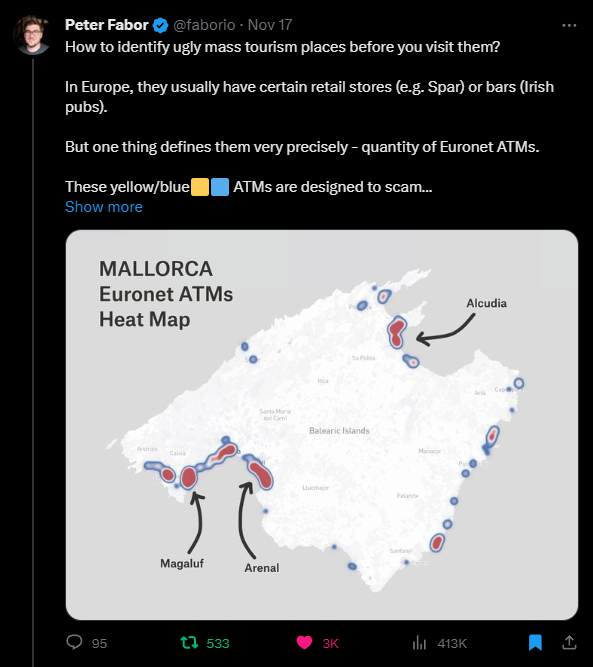
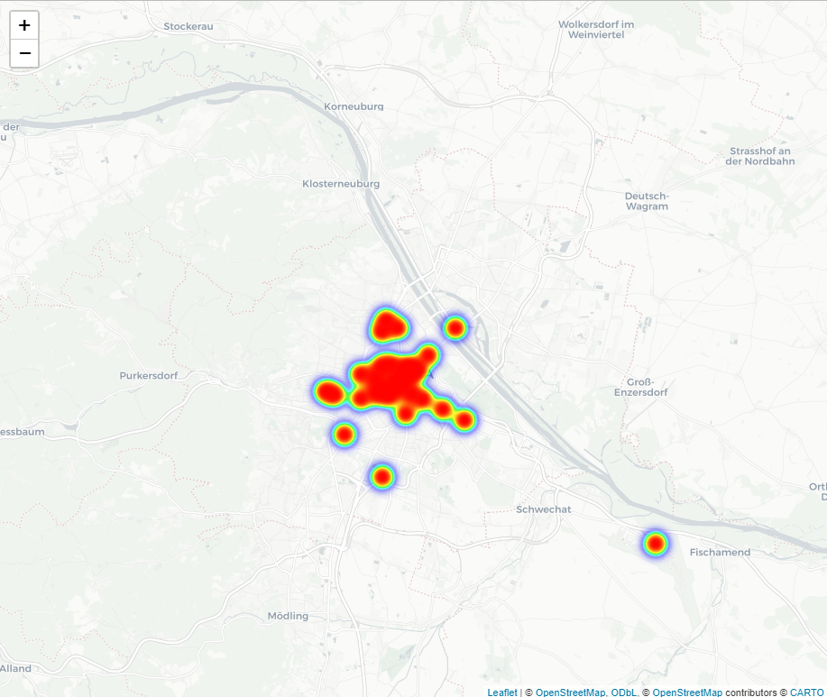
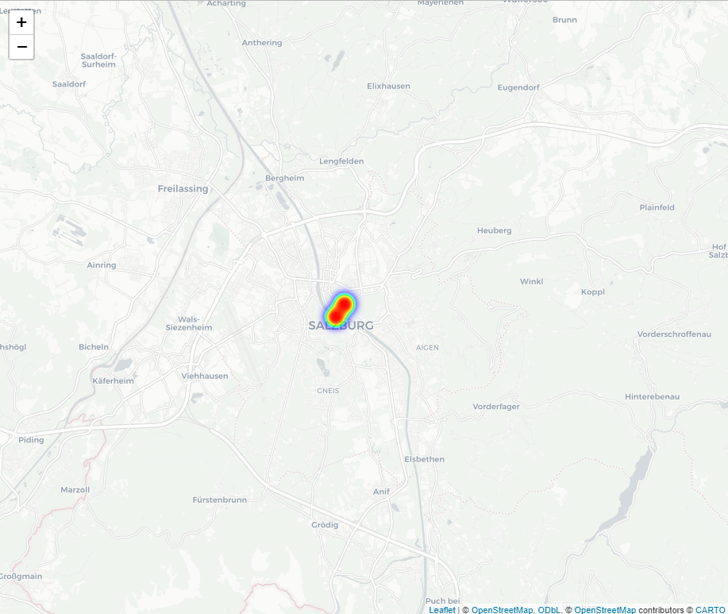
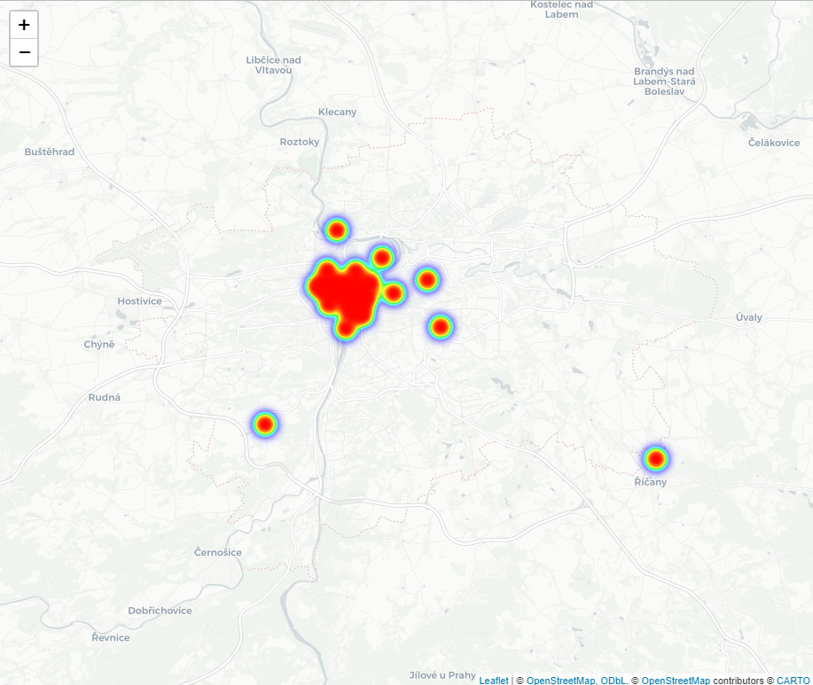
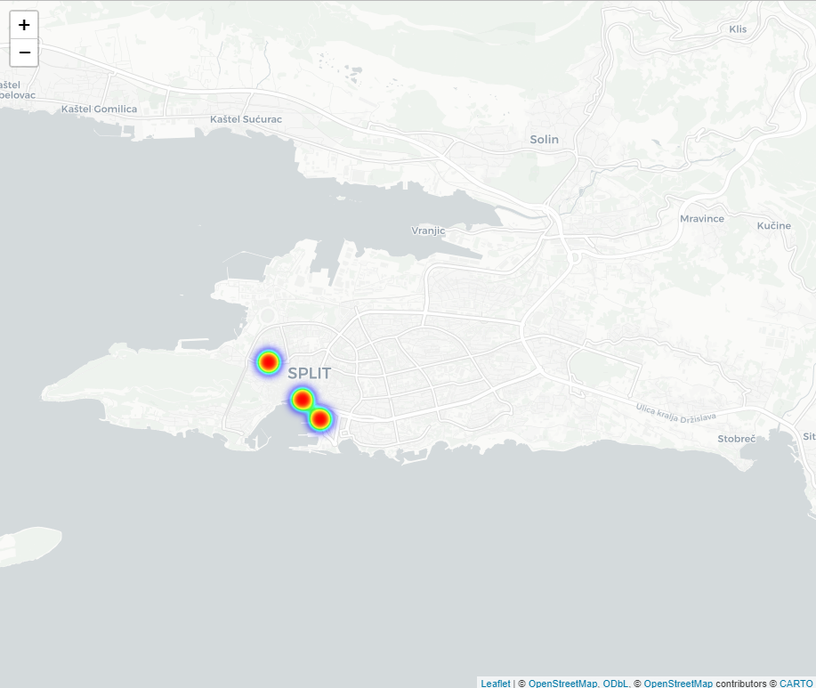
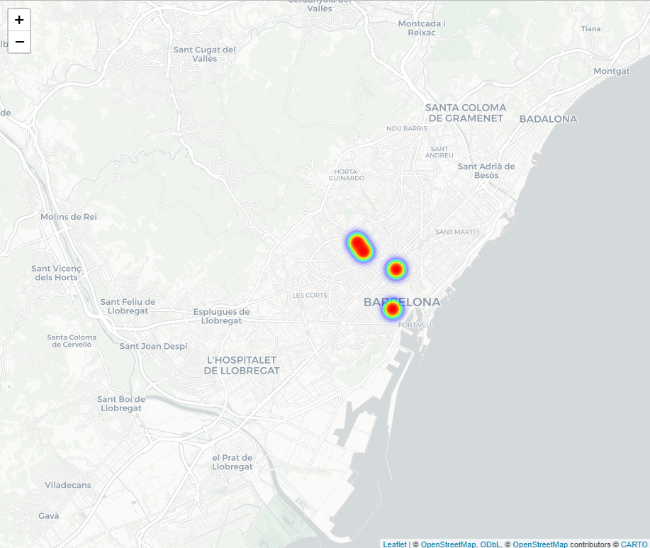
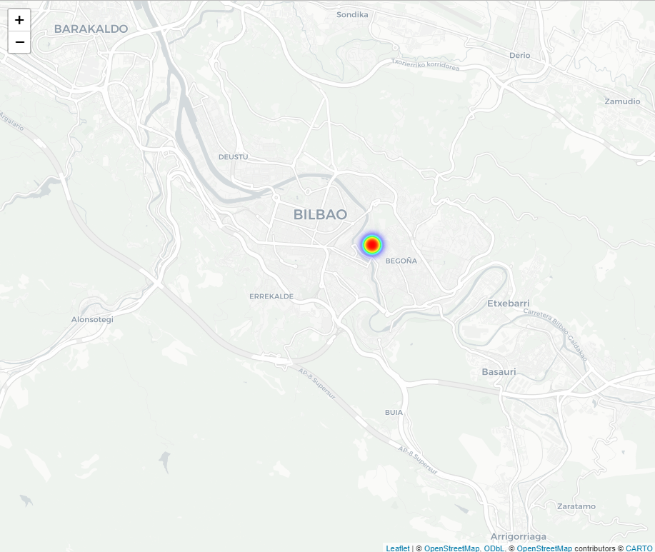
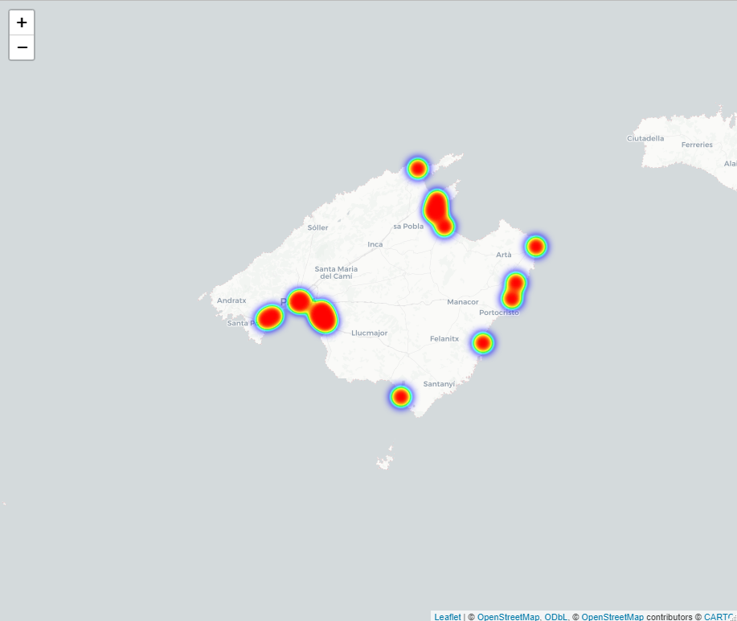

# Euronet ATM Heatmap

This R script generates a EuroNet ATM heatmap in order to highlight tourist spots.

What are EuroNet ATMs? 

Euronet is a company operating ATMs in tourist hotspots. These ATMs usually overcharge customers with high fees and unfavorable exchange rates.

For more details how these ATMs trick their customers see this YouTube Video by the HONEST GUIDE: https://www.youtube.com/watch?v=v1Hh8kY_hOY

## The Idea

The idea was originally brought to my attention by @faborio on [Twitter](https://x.com/faborio/status/1725631676309463137?s=20).

As Euronet ATMs are only operated in tourist hotspots the presence of Euronet ATMs in a certain area is a good indication of high volume of tourists.

So if you want to avoid overly touristy areas, then you can simply avoid the areas with a high concentration of Euronet ATMs

## Examples

### Vienna

### Salzburg

### Praha

### Split

### Barcelona

### Bilbao

### Mallorca

## The implementation

This R script was quickly built with the help of ChatGPT to download the data for a certain area from openstreetmap and display a heatmap for Euronet ATMs.

## Usage

Download R-Studio and run the script.

In order to view a different city/region just change the city name.

Attention: For larger regions it might take very long to fetch the data.